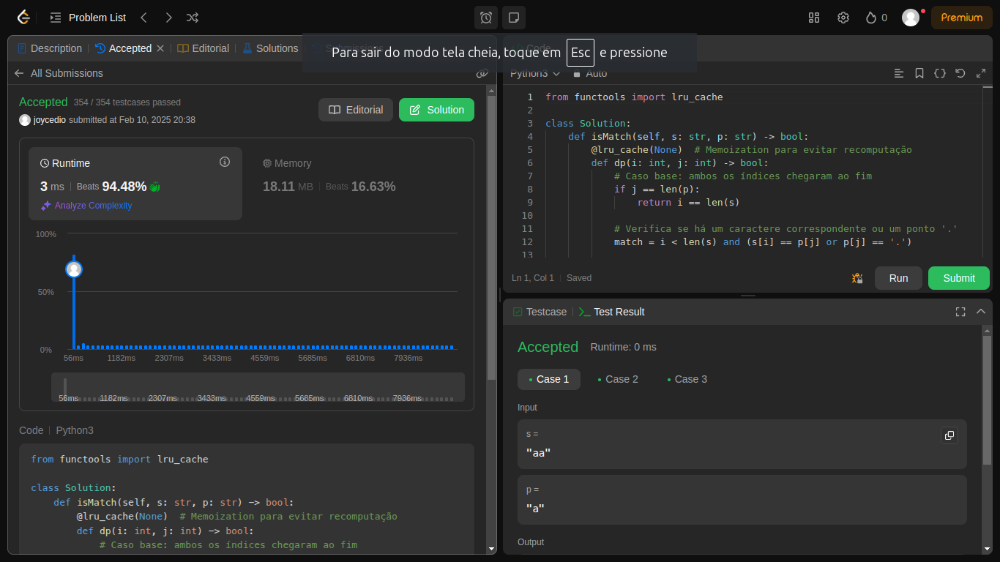
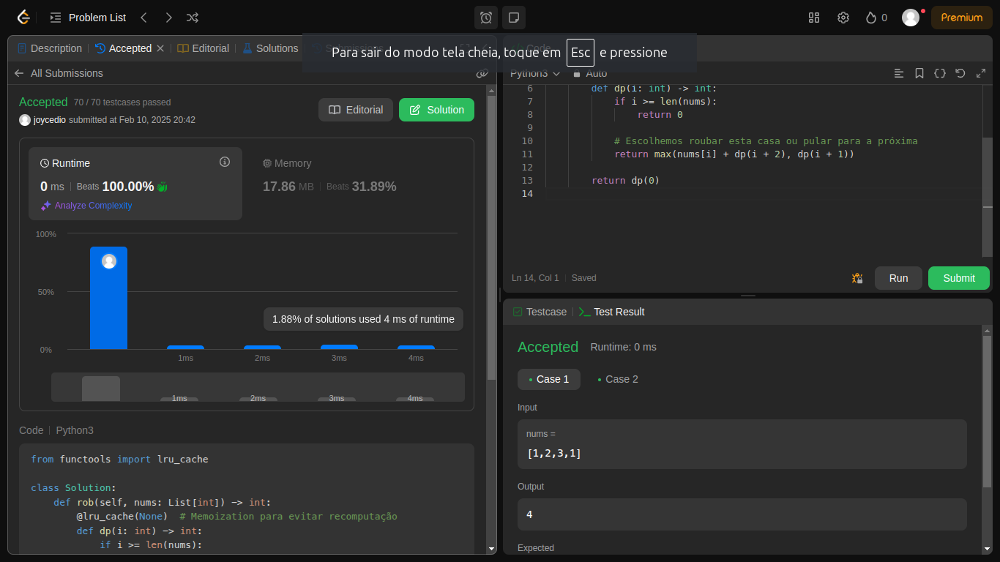
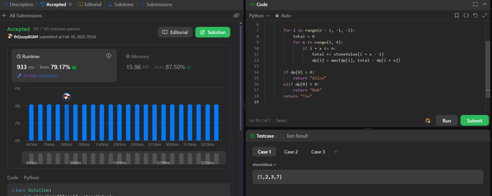
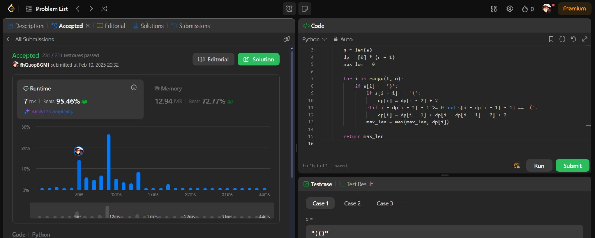

# Questions LeetCode

**Número da Lista**: 11 
**Conteúdo da Disciplina**: PD 

## Alunos
|Matrícula | Aluno |
| -- | -- |
| 18/0098683 |  BRENO YURI BARBOSA GOMES |
| 21/1063176  |  JOYCE DIONIZIO DE MESQUITA |

## Sobre 
Esse projeto tem o objetivo de realizar problemas de média e alta complexidade no juíz LeetCode. Os exercícios serão resolvidos com base no conteúdo do conteúdo PD. 

## Apresentação
[Link da Apresentação](https://www.youtube.com/watch?v=N516GSY-opw)

#### [10. Regular Expression Matching](https://leetcode.com/problems/regular-expression-matching/description/)
**Dificuldade:** Hard    

#### [198. House Robber](https://leetcode.com/problems/house-robber/description/)
**Dificuldade:** Medium  

#### [1406. Stone Game III](https://leetcode.com/problems/stone-game-iii/description/)
**Dificuldade:** Hard   

#### [32. Longest Valid Parentheses](https://leetcode.com/problems/longest-valid-parentheses/description/)
**Dificuldade:** Hard   

**Linguagem**: Python 

